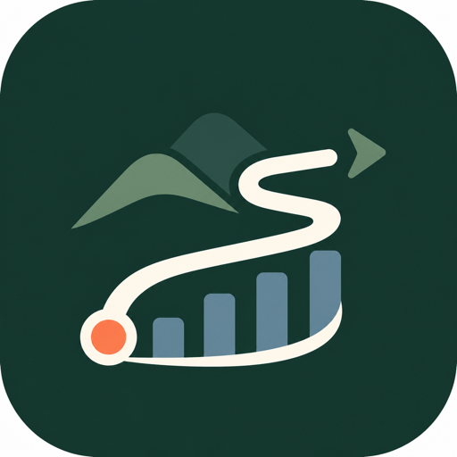
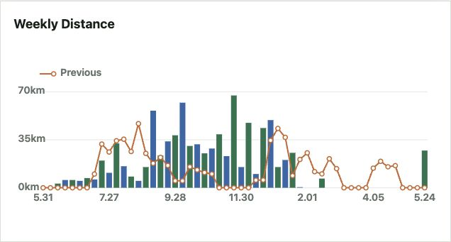
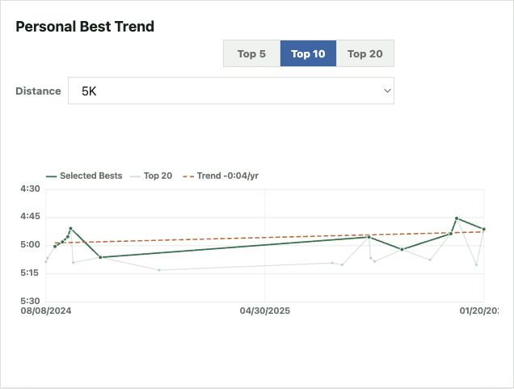
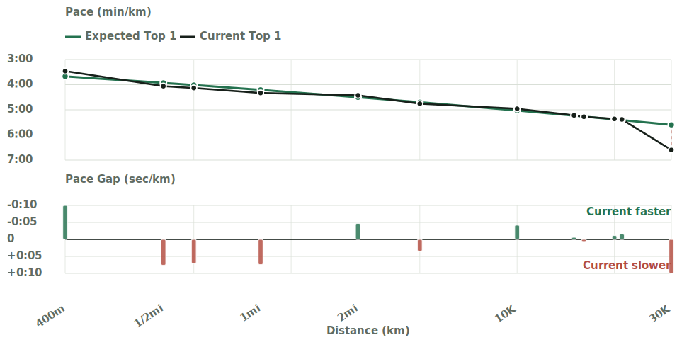

<p align="center">
  
</p>

# Runasis

Runasis is an unofficial running dashboard for [Strava](https://www.strava.com/). It brings your running history into a local app, then turns it into clear summaries, personal-best charts, and race-time projections.

It is built for runners who want to understand their own training history without uploading data to another service. Your Strava API credentials, tokens, and activity data stay on your machine.

## Example Screens

<table>
  <tr>
    <td></td>
    <td></td>
    <td></td>
  </tr>
</table>

## What You Can See

- Training totals and recent volume by date range
- Cumulative progress, weekly trends, and distance distribution
- Longest runs, recent activities, and a searchable activity list
- Personal bests and trend charts from Strava best-effort data
- Riegel race projections for comparing 5K, 10K, half-marathon, marathon, and other distances

## Before You Start

You need:

- Node.js 18 or newer
- A Strava account
- A Strava API application

Runasis uses your own Strava API app to connect from your computer and save results locally. See Strava's [Getting Started guide](https://developers.strava.com/docs/getting-started/) for creating an API application and finding your Client ID and Client Secret.

## Start Runasis

On macOS, double-click:

```text
Runasis.command
```

This starts Runasis and opens it in your browser. Close the terminal window or press `Ctrl+C` to stop it.

You can also start it from a terminal:

```bash
npm start
```

Then open the URL printed by the server, usually:

```text
http://localhost:3000
```

If port `3000` is already in use, Runasis automatically tries the next available port.

## Connect Strava

1. Go to Strava `Settings > My API Application`.
2. Create or open your API application.
3. Set `Authorization Callback Domain` to `localhost`.
4. Start Runasis.
5. Enter your Strava Client ID and Client Secret, then click `Save Settings`.
6. Click `Connect Strava` and approve the connection.
7. Click `Sync` to import your activity list and fetch any missing best-effort details.

Large histories can take a while to sync. Best-effort details are fetched in batches, so click `Sync` again if Runasis says more records remain.

## Using Runasis

### Dashboard

The dashboard is the main training overview. Use the range selector and metric cards to switch between distance, activity count, moving time, elevation gain, and time windows. The `Recent Activities` panel also links to a searchable activity list.

### Personal Bests

The `Personal Bests` tab compares your best efforts across distances, including pace curves, dates, trends, and ranked efforts. If you edit an activity later in Strava, refresh that activity from its row in Runasis.

### Analysis

The `Analysis` tab uses the [Riegel model](https://en.wikipedia.org/wiki/Peter_Riegel#Race_time_prediction) to compare race distances, estimate equivalent performances, and highlight stronger or weaker distances. You can use the default exponent, estimate one from your best efforts, or set a custom value.

## macOS App Wrapper

Runasis also includes an optional macOS app wrapper. You only need this if you want an app window instead of opening the browser yourself.

Build it with:

```bash
scripts/build-macos-app.sh
```

Then open `Runasis.app` in Finder from this project folder. Closing the app window stops the local server.

Rebuilding the wrapper requires Xcode Command Line Tools.

## Development

Run the app:

```bash
npm start
```

Run tests:

```bash
npm test
```

Runasis currently uses Node.js built-ins only, so there are no package dependencies to install.
