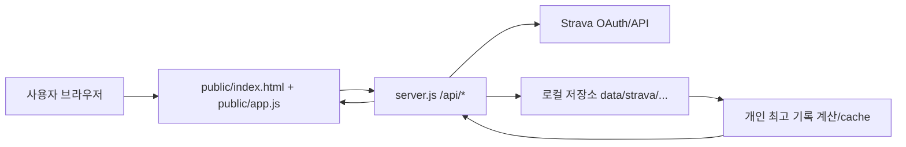

# 아키텍처와 데이터 흐름

Runasis는 단일 Node 서버가 정적 프론트엔드와 API를 함께 제공하는 구조입니다. Strava API 호출, OAuth callback 처리, 로컬 JSON 저장, 개인 최고 기록 계산이 대부분 `server.js` 안에 모여 있고, 화면 렌더링과 상호작용은 `public/app.js`가 담당합니다.

## 서버 역할

`server.js`가 담당하는 핵심 역할입니다.

- Node.js 18 이상 런타임 확인
- `.env` 기반 Strava 설정 로드와 저장
- Strava OAuth 시작 및 callback 처리
- 활동 목록, 상세 activity, stream fetch
- 로컬 저장소 읽기/쓰기와 clear data 처리
- personal best, time best, pace best 계산과 cache 관리
- 정적 파일 제공
- 로컬 서버 보안 경계 확인

## 주요 API

- `GET /api/status`: 연결 상태, 활동 수, 동기화 상태 요약
- `GET /api/activities`: 활동 목록과 per-activity detail 상태
- `GET /api/personal-bests`: 개인 최고 기록, 시간 기준 best, 페이스 기준 best
- `POST /api/excluded-records`: 특정 record 제외/복구
- `POST /api/config/strava`: Strava API 설정 저장
- `POST /api/sync`: 활동 목록 동기화
- `POST /api/activity-details/sync`: 상세 activity와 stream 동기화
- `POST /api/activity-details/refresh`: 단일 activity 상세 정보 강제 갱신
- `DELETE /api/data`: 로컬 저장 데이터 삭제

## 프론트엔드 역할

`public/index.html`은 화면 구조를 정의하고, `public/app.js`는 상태, 이벤트, API 호출, SVG 차트 렌더링을 담당합니다.

주요 화면은 다음과 같습니다.

- Dashboard: 기간별 KPI, 누적 chart, 주간 chart, 거리 분포, 롱런, 최근 활동
- Activity list: 전체 활동 검색, 필터, 정렬, 단일 refresh
- Personal Bests: 거리 best, 시간 best, 목표 페이스 best
- Analysis: Riegel exponent, baseline 선택, expected/current 비교, projection

## 보안과 로컬 경계

- 서버 host는 기본적으로 loopback 계열만 허용합니다.
- 상태 변경 API는 origin/referer와 CSRF header를 확인합니다.
- JSON request body는 content type과 크기 제한을 둡니다.
- `.env`와 `data/` 내부 민감 값은 노트화 대상이 아닙니다.

## 관련 노트

- [[실행과 설정]]
- [[개발과 테스트]]
- [[현재 triage 상태]]
